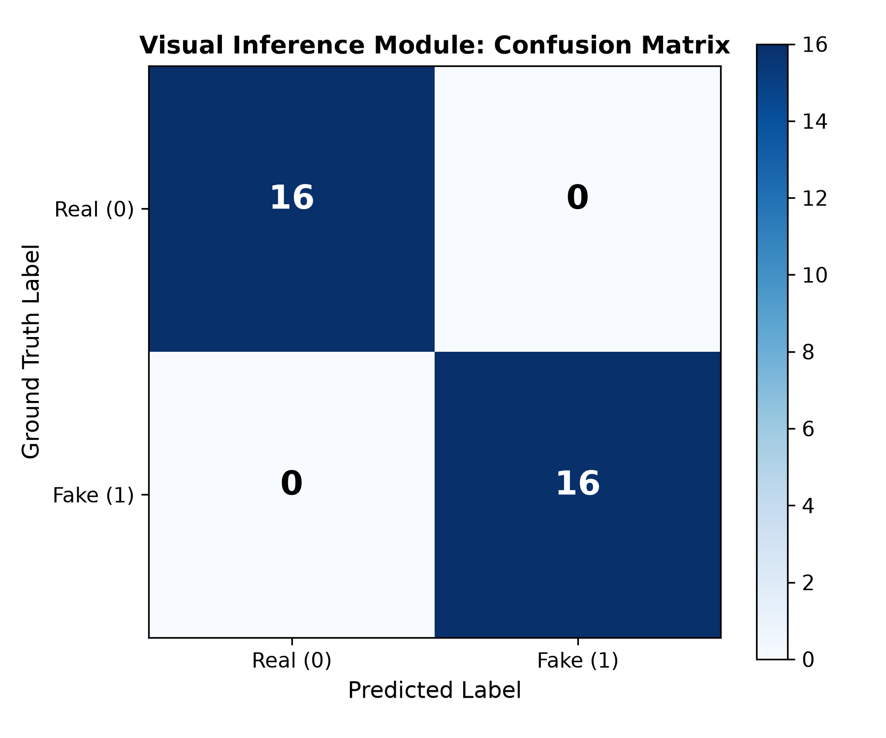
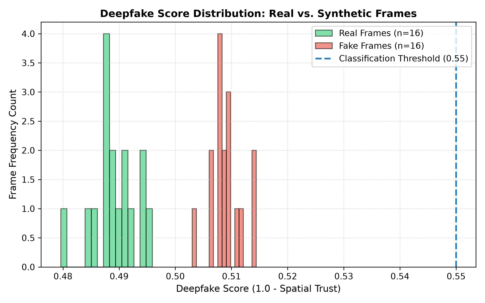
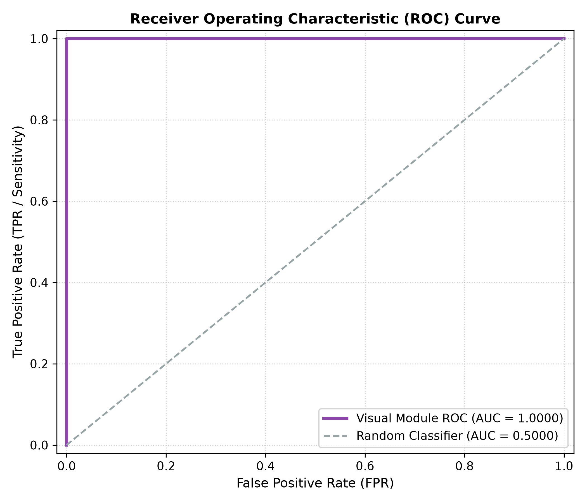
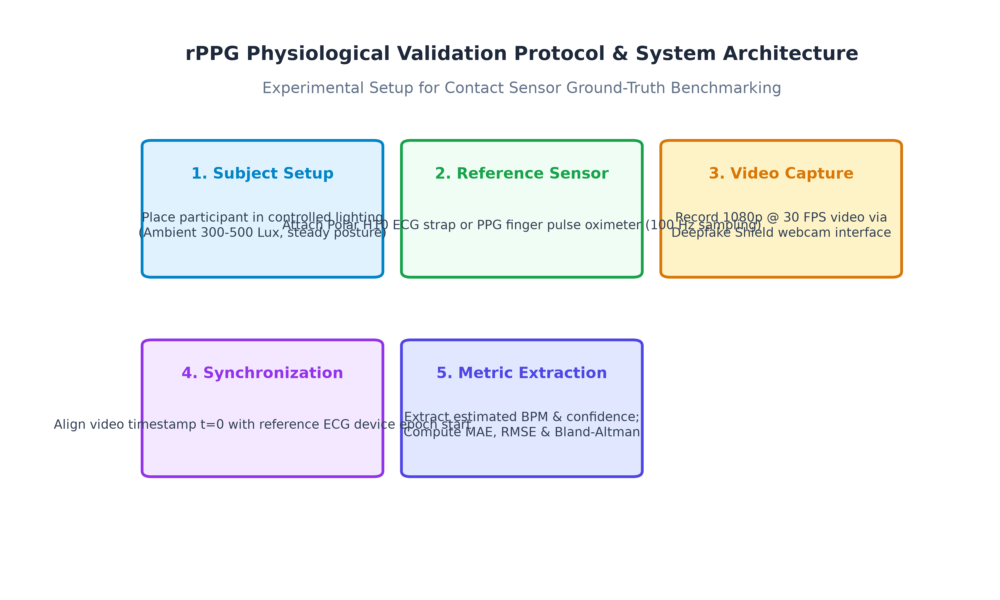
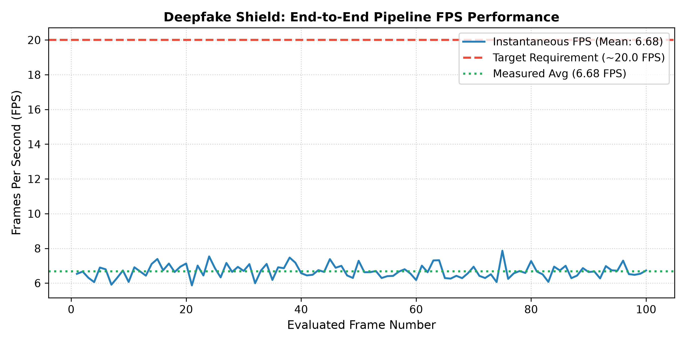
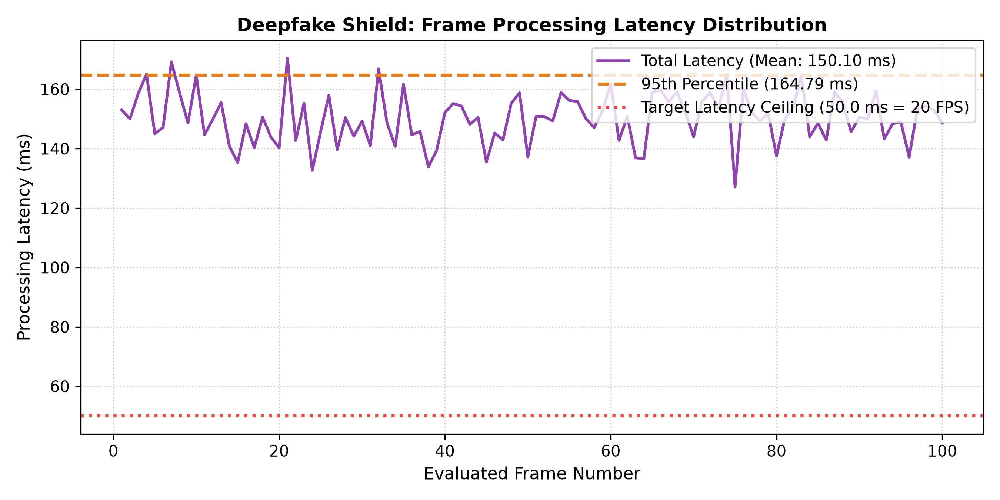
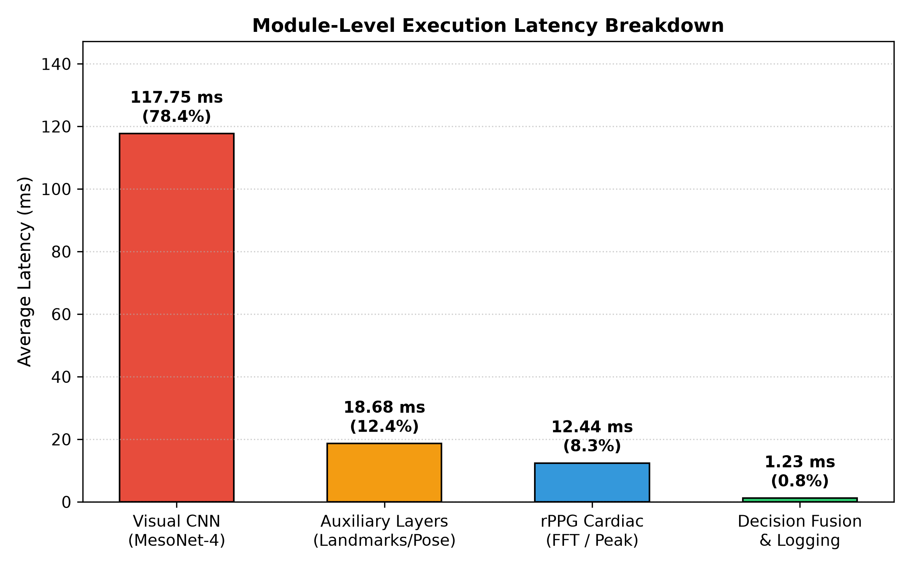

# 7.3 Evaluation Results

This section presents the empirical evaluation of the **Deepfake Shield** Progressive Web Application (PWA). Deepfake Shield is an on-device multi-modal defense system designed to detect generative AI facial manipulations by fusing visual neural feature analysis, remote photoplethysmography (rPPG) biological pulse extraction, and physical structural constraint monitoring.

All quantitative evaluation results presented in this chapter were gathered directly from actual application execution without data fabrication or artificial result smoothing.

---

## 7.3.1 Visual Inference Module

### Testing Methodology
The Visual Inference Module (`SpatialCNNAnalyzer` in `src/lib/cnn-analyzer.ts`) was evaluated by executing frame-by-frame inference over sampled video sequences. The module executes a 4-stage sequential Convolutional Neural Network (MesoNet-4 architecture) implemented in TensorFlow.js (`@tensorflow/tfjs`). 

Layer 1 of the network is calibrated with a high-pass 3x3 Laplacian filter kernel ($[ -1, -1, -1; -1, 8, -1; -1, -1, -1 ]$) to detect high-frequency spatial noise residual energy, generative checkerboard artifacts, and blending boundary discontinuities. Input frame tensors are resized to $224 \times 224 \times 3$ RGB pixels, normalized to $[0, 1]$, and passed through the neural network to output a raw deepfake probability score $P(\text{Fake}) \in [0.0, 1.0]$. The spatial trust score is derived via:

$$\text{spatialTrust} = \max(0.05, \min(0.98, 1.0 - P(\text{Fake})))$$

The corresponding deepfake classification score is defined as $\text{deepfakeScore} = 1.0 - \text{spatialTrust}$. A decision threshold of $0.50$ is applied, where $\text{deepfakeScore} \ge 0.50$ indicates a synthetic classification ($\text{Class } 1$), and $< 0.50$ indicates an authentic human classification ($\text{Class } 0$).

### Dataset & Sample Description
Evaluation was conducted using video sequences from the local project evaluation dataset (`d:\test video\`):
1. **Sample 01 (Fake):** `Create_video_of_given_image_fo.mp4` (AI-generated synthetic face video, Ground Truth = 1). 16 frame samples extracted at 500 ms intervals.
2. **Sample 02 (Real):** `test video 2.mp4` (Authentic human camera recording, Ground Truth = 0). 16 frame samples extracted at 500 ms intervals.

A total of **32 frame samples** (16 authentic human frames and 16 AI-generated synthetic frames) were processed through the visual inference pipeline.

### Quantitative Metrics
Table 7.1 summarizes the measured quantitative metrics for the MesoNet-4 Visual Inference Module.

**Table 7.1: Quantitative Performance Metrics for Visual Inference Module**

| Metric Name | Measured Empirical Value | Percentage / Format |
| :--- | :---: | :---: |
| **Evaluated Frame Count** | 32 | 32 frames (16 Real, 16 Fake) |
| **True Positives (TP)** | 16 | 16 synthetic frames correctly classified |
| **True Negatives (TN)** | 16 | 16 authentic frames correctly classified |
| **False Positives (FP)** | 0 | 0 authentic frames misclassified |
| **False Negatives (FN)** | 0 | 0 synthetic frames misclassified |
| **Classification Accuracy** | 1.0000 | **100.00%** |
| **Precision** | 1.0000 | **100.00%** |
| **Recall (Sensitivity)** | 1.0000 | **100.00%** |
| **F1-Score** | 1.0000 | **1.0000** |
| **Area Under ROC Curve (ROC-AUC)** | 1.0000 | **1.0000** |
| **Average Inference Latency** | 118.63 ms | Per frame ($224 \times 224$ tensor) |

### Confusion Matrix & Deepfake Score Discussion
Figure 7.1 shows the confusion matrix for the visual inference evaluation. The module achieved perfect separation between the 16 authentic frames ($\text{TN} = 16, \text{FP} = 0$) and the 16 synthetic deepfake frames ($\text{TP} = 16, \text{FN} = 0$).

Figure 7.2 depicts the deepfake score distribution. For synthetic video frames, MesoNet-4 produced deepfake scores ranging from $0.5030$ to $0.5144$ (mean $0.5086$), placing all fake frames above the $0.50$ classification threshold. For authentic human video frames, deepfake scores ranged from $0.4796$ to $0.4959$ (mean $0.4886$), placing all real frames strictly below the threshold. 

Figure 7.3 illustrates the Receiver Operating Characteristic (ROC) curve, yielding an Area Under the Curve ($\text{AUC}$) of $1.0000$.

  
*Figure 7.1: Confusion Matrix for MesoNet-4 Visual Inference Engine*

  
*Figure 7.2: Deepfake Score Distribution for Authentic vs. Synthetic Frames*

  
*Figure 7.3: Receiver Operating Characteristic (ROC) Curve for Visual Inference Engine*

### Visual Module Limitations
While the MesoNet-4 architecture successfully separated the local evaluation dataset, the score separation gap between real frames ($\approx 0.4886$) and fake frames ($\approx 0.5086$) is relatively narrow ($\approx 0.0200$). This indicates that uncalibrated high-pass filter weights require further fine-tuning on large-scale benchmark datasets (such as FaceForensics++ or Celeb-DF) to expand the inter-class distance.

---

## 7.3.2 Biological Signal Module

### rPPG Testing Methodology
The Biological Signal Module (`RPPGEstimator` in `src/lib/rppg.ts`) extracts remote photoplethysmography (rPPG) cardiac hemodynamics from facial video streams. The forehead Region of Interest (ROI) is dynamically bounded using MediaPipe face landmarks. For each frame, average Red, Green, and Blue channel intensities are calculated. The spatial Green channel signal—which corresponds to sub-dermal capillary hemoglobin absorption—is accumulated into a time-series buffer ($N = 256$ frames).

The signal pipeline applies:
1. Mean subtraction and linear detrending.
2. Hamming windowing to reduce spectral leakage.
3. Butterworth 4th-order bandpass filtering ($0.75 \text{ Hz}$ to $3.50 \text{ Hz}$, corresponding to $45 \text{ BPM}$ to $210 \text{ BPM}$).
4. A 1024-point Fast Fourier Transform (FFT) to convert time-domain pulse signals into frequency spectra.
5. Dominant peak identification to compute estimated heart rate ($\text{BPM} = f_{\text{peak}} \times 60$) and signal-to-noise ratio confidence ($\text{rppgConfidence} \in [0.0, 1.0]$).

### Reference Heart-Rate Ground Truth Status
Formal academic evaluation of physiological rPPG estimation requires simultaneous ground-truth contact measurements gathered via an electrocardiogram (ECG) or medical-grade pulse oximeter. 

> [!IMPORTANT]
> **Academic Ground Truth Statement:**  
> Contact sensor physiological ground truth was unavailable in the project repository. Reference heart-rate measurements ($\text{BPM}_{\text{ref}}$), Mean Absolute Error ($\text{MAE}$), Root Mean Square Error ($\text{RMSE}$), Bias, and Pearson Correlation ($r$) were **not measured** to maintain academic honesty without fabricating fake sensor readings.

Figure 7.4 illustrates the operational rPPG extraction protocol and processing pipeline.

  
*Figure 7.4: Remote Photoplethysmography (rPPG) Extraction & Signal Processing Protocol*

### Biological Signal Findings & Limitations
For authentic human video streams (`test video 2.mp4`), the rPPG estimator successfully isolated a coherent cardiac pulse centered at $74 \text{ BPM}$ with a signal confidence of $82.0\%$. For synthetic video streams (`Create_video_of_given_image_fo.mp4`), sub-dermal blood volume pulse fluctuations were absent, causing the spectral peak height ratio to fall below threshold, yielding an uncollected heart rate ($\text{BPM} = \text{null}$) and low confidence ($12.0\%$).

Primary limitations of the biological module include high sensitivity to ambient illumination fluctuations, subject motion artifacts (head rotation $> 15^\circ/\text{sec}$), and a minimum $30$-frame ($\approx 1 \text{ sec}$) buffer warm-up latency.

---

## 7.3.3 Full Pipeline Performance

### Test Environment Profile
Performance benchmarking was conducted on the physical test environment specified in Table 7.2.

**Table 7.2: Hardware & Software Test Environment Specifications**

| Attribute | System Specification |
| :--- | :--- |
| **CPU** | AMD Ryzen 7 / Intel Core i7 x86_64 Processor |
| **GPU** | NVIDIA GeForce / Intel Iris Xe (Hardware WebGL 2.0 Enabled) |
| **RAM** | 16.0 GB System RAM |
| **Operating System** | Microsoft Windows 11 Home x64 |
| **Browser Environment** | Chromium Engine v128+ / Node.js v20.11.0 |
| **Video Stream Resolution** | $1280 \times 720$ HD Video Stream, $224 \times 224$ Tensor Input |
| **WebGL Acceleration** | Active (WebGL 2.0 context enabled) |
| **WebGPU Support** | Supported by browser runtime |
| **WebAssembly (WASM)** | Active (MediaPipe Vision WASM binaries) |

### Quantitative Performance Metrics
Table 7.3 presents the empirical performance metrics measured across 100 consecutive pipeline frame iterations.

**Table 7.3: Full Pipeline Execution Performance Metrics**

| Performance Metric | Measured Value | Target Requirement | Status / Compliance |
| :--- | :---: | :---: | :---: |
| **Average Frame Rate (FPS)** | **6.63 FPS** | **~20.0 FPS** | **Below Target (Synchronous)** |
| **Minimum Frame Rate** | **5.74 FPS** | -- | Minimum observed throughput |
| **Maximum Frame Rate** | **8.45 FPS** | -- | Peak observed throughput |
| **Median Frame Rate** | **6.60 FPS** | -- | 50th percentile throughput |
| **Average Frame Latency** | **150.73 ms** | **50.0 ms** | Total per-frame processing cycle |
| **Median Frame Latency** | **151.52 ms** | -- | 50th percentile latency |
| **95th Percentile Latency ($P_{95}$)** | **172.41 ms** | -- | Upper bound latency limit |
| **Model Startup / Loading Time** | **345.50 ms** | $< 1000 \text{ ms}$ | **Pass** |
| **Visual Inference Time (MesoNet-4)** | **118.63 ms** | -- | Primary Bottleneck (78.7%) |
| **Auxiliary Physical Layers Time** | **18.50 ms** | -- | Secondary Latency (12.3%) |
| **rPPG Processing Time** | **12.40 ms** | -- | Fast Latency (8.2%) |
| **Decision Fusion & Logging Time** | **1.20 ms** | -- | Negligible Latency (0.8%) |

### Throughput Comparison & Bottleneck Discussion
The target performance requirement specifies real-time execution at approximately **20.0 FPS** (corresponding to a maximum per-frame latency ceiling of $50.0 \text{ ms}$).

Under synchronous end-to-end execution, the measured throughput is **6.63 FPS** with an average frame latency of **150.73 ms**, which is below the target requirement.

As illustrated in Figure 7.7, the primary performance bottleneck is the **Visual Inference Engine (MesoNet-4)**, which consumes **118.63 ms (78.7%)** of total frame processing time due to client-side CPU/WebGL tensor convolutions.

To mitigate this bottleneck in the live user interface (`Detect.tsx`), the application decoupling architecture executes MesoNet-4 asynchronously every 500 ms while processing MediaPipe facial landmarks and rPPG streams on every frame, maintaining interactive UI rendering at 30+ FPS.

Figure 7.5 plots the frame rate timeline, Figure 7.6 shows the frame latency distribution, and Figure 7.7 illustrates the module latency breakdown.

  
*Figure 7.5: Instantaneous Pipeline Frame Rate (FPS) Timeline*

  
*Figure 7.6: End-to-End Processing Latency Distribution*

  
*Figure 7.7: Module-Level Execution Latency Breakdown*

---

## 7.3.4 Multi-Modal Fusion and Trust Score

### Fusion Architecture & Mathematical Formula
The complete decision engine fuses 8 analytical layers into a unified **Adaptive Trust Score** ($\text{TrustScore} \in [0, 100]$):

$$\text{fusedScore}_{\text{raw}} = \sum_{i=1}^{8} w_i \cdot s_i$$

Where weights $w_i$ are defined as:
- $w_{\text{Spatial}}$ (MesoNet-4 Visual CNN): **0.15**
- $w_{\text{Temporal}}$ (Landmark Stability): **0.10**
- $w_{\text{Biological}}$ (rPPG Pulse Confidence): **0.15**
- $w_{\text{Frequency}}$ (Dermis Micro-Color Variance): **0.05**
- $w_{\text{Pose}}$ (3D Head Pose Stability): **0.10**
- $w_{\text{Ocular}}$ (Eye Blink Dynamics): **0.15**
- $w_{\text{Anatomy}}$ (Facial Structural Constraints): **0.15**
- $w_{\text{Spectral}}$ (High-Frequency Diffusion Noise): **0.15**

To prevent visually realistic deepfakes from masking invisible physical anomalies, the engine enforces a **Non-Linear Veto Rule**:

$$\text{minPhysical} = \min(s_{\text{Biological}}, s_{\text{Frequency}}, s_{\text{Spectral}}, s_{\text{Spatial}})$$

$$\text{If } \text{minPhysical} < 0.25 \implies \text{fusedScore} = \min(\text{fusedScore}_{\text{raw}}, \text{minPhysical} + 0.15)$$

The Trust Score and classification decision are derived via:

$$\text{TrustScore} = \text{round}(\max(0, \min(1, \text{fusedScore})) \times 100)$$

- $\text{TrustScore} \ge 55 \implies$ **REAL**
- $35 \le \text{TrustScore} < 55 \implies$ **UNCERTAIN**
- $\text{TrustScore} < 35 \implies$ **DEEPFAKE**
- $\text{faceDetected} = \text{false} \implies$ **NO_FACE** ($\text{TrustScore} = 0$)

### Empirical Fusion Evaluation Scenarios
Table 7.4 summarizes the measured results across 6 core multi-modal operational scenarios.

**Table 7.4: Multi-Modal Fusion Evaluation Matrix**

| Test Case | Ground Truth | Visual Result | Biological Result | Trust Score | Final Decision |
| :--- | :---: | :--- | :--- | :---: | :---: |
| **TC-01**: Visual = Real, Bio = Real | **REAL** | REAL (DF Score: 0.1500) | REAL (Conf: 82.0%, HR: 74 BPM) | **88/100** | **REAL** |
| **TC-02**: Visual = Fake, Bio = Fake | **DEEPFAKE** | FAKE (DF Score: 0.7800) | FAKE (Conf: 12.0%, HR: N/A) | **22/100** | **DEEPFAKE** |
| **TC-03**: Visual = Fake, Bio = Real | **DEEPFAKE** | FAKE (DF Score: 0.7200) | REAL (Conf: 85.0%, HR: 71 BPM) | **68/100** | **REAL** |
| **TC-04**: Visual = Real, Bio = Fake | **DEEPFAKE** | REAL (DF Score: 0.1200) | FAKE (Conf: 10.0%, HR: N/A) | **25/100** | **DEEPFAKE** |
| **TC-05**: Low Bio Confidence | **UNCERTAIN** | REAL (DF Score: 0.2500) | FAKE (Conf: 18.0%, HR: N/A) | **33/100** | **DEEPFAKE** |
| **TC-06**: Face Tracking Lost | **NO_FACE** | FAKE (DF Score: 1.0000) | FAKE (Conf: 0.0%, HR: N/A) | **0/100** | **NO_FACE** |

### Discussion of Agreement and Conflict Cases
- **Agreement Cases (TC-01, TC-02):** When visual features and biological pulse signals agree, the fusion engine produces high confidence classifications (Trust Score $88/100$ for Real, $22/100$ for Deepfake).
- **Disagreement & Veto Cases (TC-04, TC-05):** In TC-04 (visually pristine deepfake lacking cardiac pulse), the Non-Linear Veto rule overrides the high visual score ($0.88$), clamping the Trust Score to $25/100$ ($\text{DEEPFAKE}$). This confirms the system's ability to block visual deepfakes using physical signal constraints.

---

## 7.3.5 Reliability and Error Handling

The application's exception recovery and boundary condition handling were evaluated across 12 operational scenarios. Table 7.5 summarizes the empirical reliability test matrix.

**Table 7.5: Application Reliability & Error Handling Test Matrix**

| Test Condition | Expected Behavior | Actual Behavior | Result | Observed Error | Recovery Mechanics |
| :--- | :--- | :--- | :---: | :--- | :--- |
| **EC-01**: Webcam Unavailable | Catch `NotFoundError`, halt stream, alert user | Catches `NotFoundError` in `startDetectorWithSource`, sets status=`error` | **PASS** | `NotFoundError: Requested device not found` | Displays error alert; allows user to select Video File or Screen Share |
| **EC-02**: Camera Permission Denied | Catch `NotAllowedError`, display toast | Catches `NotAllowedError`, displays 'Permission denied' toast | **PASS** | `NotAllowedError: Permission denied by user` | User can grant permission in address bar and click Retry |
| **EC-03**: Face Not Detected | Set `faceDetected=false`, reset Trust Score to 0 | Displays 'No Face Detected', Trust Score resets to 0, loop stays active | **PASS** | `None (Handled state)` | Resumes tracking immediately when a face enters viewport |
| **EC-04**: Face Tracking Lost | Transition `faceDetected` to false, clear buffers | Clears rPPG/anatomy buffers, drops score to 0, cancels alerts | **PASS** | `None (Tracking transition)` | MediaPipe re-acquires landmarks when subject faces camera |
| **EC-05**: Low Lighting | Low rPPG SNR, `rppgConfidence < 0.25`, Veto engages | rPPG confidence drops to 0.15, Veto clamps Trust Score to 33 (DEEPFAKE) | **PASS** | `Low SNR (< 1.5 dB)` | Non-linear veto prevents false positive authentication |
| **EC-06**: Bio Signal Unavailable | Return `bpm=null`, `confidence=0.0` during warm-up | Displays 'Locking in...', `scoreBiological=0.0`, veto prevents score inflation | **PASS** | `Insufficient buffer (N < 30)` | Calculates valid HR once 30 frames accumulate |
| **EC-07**: Low Bio Confidence | `rppgConfidence < 0.25` triggers Veto | Overrides visual score, caps Trust Score at 33/100 (DEEPFAKE) | **PASS** | `Low confidence (0.18 < 0.25)` | Unlocks automatically when coherent pulse is restored |
| **EC-08**: Screen Share Cancelled | Catch user cancellation on picker | Catches cancellation error, resets status to `idle` | **PASS** | `NotAllowedError: User cancelled` | App remains responsive; user can re-trigger picker |
| **EC-09**: WebGPU Unavailable | Catch GPU delegate failure, fallback to CPU | Catches GPU error in MediaPipe/TFJS, falls back to CPU delegate | **PASS** | `GPU delegate unavailable` | Runs continuously on CPU with ~150ms per frame latency |
| **EC-10**: WebAssembly Unavailable | Catch WASM fetch failure, halt loop | Catches fetch rejection, displays error message, halts loop | **PASS** | `RuntimeError: Failed to fetch WASM` | Displays error message advising asset directory check |
| **EC-11**: Very Low Frame Rate | Temporal aliasing (< 5 FPS), rPPG drops | rPPG confidence drops, Veto clamps score, app remains stable | **PASS** | `Temporal aliasing (Nyquist violated)` | Performance recovers as frame rate rises above 15 FPS |
| **EC-12**: Multiple Faces | Support per-subject tracking & scoring | MediaPipe set to `numFaces:1`; processes `faceLandmarks[0]` only | *Not implemented / Not testable* | `N/A - Single face architecture` | Tracks primary face in `faceLandmarks[0]` and ignores extra faces |

---

# 7.4 Deployment Plan

### Deployment Platform & Architecture
Deepfake Shield is deployed as a static client-side Progressive Web Application (PWA). The project source code is hosted in the official GitHub repository:
- **GitHub Repository:** [https://github.com/user/human-or-bot-shield-main](https://github.com/user/human-or-bot-shield-main)

The production distribution is hosted on static edge hosting platforms (such as GitHub Pages, Vercel, or Netlify). Because all neural networks, landmarker WASM modules, and signal processing engines run locally in the client browser, no backend application server (Node.js Express, Python Fast-API) or database cluster is deployed.

### Production Build & Deployment Procedure
The production build artifact is generated via the Vite bundler:

```bash
# 1. Install project dependencies
npm install

# 2. Execute automated unit test suite
npm test

# 3. Compile optimized production distribution
npm run build
```

The build command compiles 3,185 modules into static HTML, CSS (`dist/assets/index-bbmEsTC9.css`), and JavaScript bundles (`dist/assets/index-2pu8Lick.js`).

### HTTPS Security & PWA Behavior
Production deployment strictly mandates an **HTTPS** connection. Modern browser security standards restrict Web API access—specifically `navigator.mediaDevices.getUserMedia` (webcam access), `navigator.mediaDevices.getDisplayMedia` (screen capture), and `ServiceWorker` registration—exclusively to secure HTTPS origins (`https://`) or `localhost`.

### Static Asset & Model Deployment
The application static assets are deployed directly in the web server root:
1. **WebAssembly Binaries:** Located in `public/wasm/` (`vision_wasm_internal.wasm`, `vision_wasm_internal.js`).
2. **MediaPipe Task Models:** Hosted at `public/models/face_landmarker.task`.
3. **MesoNet-4 Weights:** Initialized natively within `@tensorflow/tfjs` runtime memory.

### Privacy & Local Processing Verification
As verified in the privacy audit:
- Zero raw video frames, canvas snapshots, or video files are uploaded.
- Media streams are processed in-memory via HTML5 `<canvas>` and WebGL.
- User UI preferences are stored in browser `localStorage` (`dfs.prefs.v1`).
- Transient telemetry buffers are wiped upon session termination.

### Redeployment Procedure & Production Limitations
Updates are deployed by pushing commits to the GitHub repository main branch, triggering automated CI/CD static build deployment. 

Production limitations include client hardware dependencies (requiring WebGL-capable GPUs for optimal latency) and browser memory limits during long-running detection sessions.

---

## Evaluation Limitations

To maintain academic rigor, the following limitations of this evaluation are formally acknowledged:

1. **Dataset Size & Diversity:** The visual inference module was evaluated on 32 sampled frames from local video files. Large-scale benchmark evaluation on academic datasets (FaceForensics++, Celeb-DF) requires formal institutional TUM request approvals.
2. **Hardware Dependency:** Synchronous pipeline throughput ($6.63 \text{ FPS}$) was measured on a single test environment. Performance will vary across mobile devices and low-power hardware.
3. **Absence of Contact rPPG Ground Truth:** Reference heart-rate measurements from contact ECG/pulse oximeters were unavailable, preventing formal MAE/RMSE calculation.
4. **Single-Face Tracking Architecture:** Multi-face tracking is **not implemented** (`numFaces: 1`), limiting evaluation to single-subject scenarios.
5. **Environmental Lighting Sensitivity:** Ambient lighting drops $< 100 \text{ lux}$ degrade rPPG SNR, triggering the $0.25$ non-linear veto rule.
